# dsh-mobile

[中文](README.md) | English

Your own [DeepSeek Harness](https://github.com/deepseek-ai/deepseek-harness), on your phone. Scan a QR, keep an encrypted tunnel, keep the official UI — composed for a hand.

This is not a second DSH, not a browser that exposes `:3080`, and not a hosted product on someone else's domain. The Host stays on the machine you already run. The Android app connects to the one Active Host you select.

## Install

Need [DeepSeek Harness](https://github.com/deepseek-ai/deepseek-harness) **0.1.2-alpha.4**, already running on the machine the phone should reach.

This is **several published packages**, not `npm i dsh-mobile`. On the Host, install **Remote** (the pairing plugin). `interaction-operations` is an independently installable Host Client plugin; the mobile APK already ships it and `ui-layout-mobile`, so a phone connection does not require putting layout source or a workstation path in the Host. Codex Sidebar is optional and recommended. Then install the APK.

```sh
dsh plugin --profile web add --force https://github.com/NOirBRight/dsh-mobile-pairing/releases/latest/download/dsh-mobile-pairing.tgz
dsh plugin --profile web add --force https://github.com/NOirBRight/dsh-mobile/releases/latest/download/dsh-mobile-interaction-operations.tgz
dsh plugin --profile web add --force https://github.com/NOirBRight/dsh-codex-sidebar/releases/latest/download/dsh-codex-sidebar.tgz
dsh web
```

The second line is the independent `interaction-operations` Host plugin; it only registers browser interaction adapters and owns neither business settings nor the mobile layout. The third line is Codex Sidebar (Files / Review / Browser / Terminal). Skip Sidebar if you only want chat.

Fixed-version (reproducible) installation:

```sh
dsh plugin --profile web add --force https://github.com/NOirBRight/dsh-mobile-pairing/releases/download/v0.1.14/dsh-mobile-pairing.tgz
dsh plugin --profile web add --force https://github.com/NOirBRight/dsh-mobile/releases/download/v1.1.6/dsh-mobile-interaction-operations.tgz
```

`@dsh-mobile/ui-layout-mobile` ships only with the APK and mobile shell. On narrow screens it replaces the official root; do not add it to a profile that serves the desktop WebUI. Maintainers of a custom mobile shell can download `dsh-mobile-ui-layout-mobile.tgz` from this Release and load it through that shell's bundle instructions.

Pairing **v0.1.14** depends on [`@dsh-mobile/e2e-tunnel` v0.1.5](https://github.com/NOirBRight/dsh-e2e-tunnel/releases/tag/v0.1.5) and is compatible only with DeepSeek Harness **0.1.2-alpha.4**. Do not add the tunnel library to the DSH plugin list; Alpha.1–Alpha.3 users should stay on the old plugin versions for their Runtime.

Then on the Host: **Settings → Plugins → DSH Mobile** (nav label **Remote**).

1. **Generate automatically** (temporary Quick Tunnel) or **Enter an address** (a Relay you were given, or [one you deployed](relay/deploy/README.md)).
2. Refresh the QR. Codes last about five minutes and are single-use.

Android APK (signed **v1.1.6**):

- Latest APK: https://github.com/NOirBRight/dsh-mobile/releases/latest/download/dsh-mobile.apk
- Fixed APK: https://github.com/NOirBRight/dsh-mobile/releases/download/v1.1.6/dsh-mobile.apk

Install the APK, open the app, scan the Host QR.

| Piece | Latest | Role |
|---|---|---|
| [dsh-mobile-pairing](https://github.com/NOirBRight/dsh-mobile-pairing) (`@dsh-mobile/pairing`) | [v0.1.14](https://github.com/NOirBRight/dsh-mobile-pairing/releases/tag/v0.1.14) | **Required.** Host plugin: QR, devices, loopback Gateway, Tunnel / Direct. This is **Remote** and supports DSH 0.1.2-alpha.4 only. |
| [dsh-mobile](https://github.com/NOirBRight/dsh-mobile) Host interaction artifact (`@dsh-mobile/interaction-operations`) | [Latest](https://github.com/NOirBRight/dsh-mobile/releases/latest/download/dsh-mobile-interaction-operations.tgz) · [v1.1.6](https://github.com/NOirBRight/dsh-mobile/releases/download/v1.1.6/dsh-mobile-interaction-operations.tgz) | Optional Host Client plugin. Provides input/popup interaction adapters only; the mobile APK uses the same bundle locally. |
| [dsh-mobile](https://github.com/NOirBRight/dsh-mobile) mobile layout artifact (`@dsh-mobile/ui-layout-mobile`) | [Latest](https://github.com/NOirBRight/dsh-mobile/releases/latest/download/dsh-mobile-ui-layout-mobile.tgz) · [v1.1.6](https://github.com/NOirBRight/dsh-mobile/releases/download/v1.1.6/dsh-mobile-ui-layout-mobile.tgz) | Narrow-screen root layout bundled in the APK; do not install it in a desktop WebUI profile. |
| [dsh-e2e-tunnel](https://github.com/NOirBRight/dsh-e2e-tunnel) (`@dsh-mobile/e2e-tunnel`) | [v0.1.5](https://github.com/NOirBRight/dsh-e2e-tunnel/releases/tag/v0.1.5) | Companion library. Pairing already depends on it. |
| [dsh-codex-sidebar](https://github.com/NOirBRight/dsh-codex-sidebar) | [v0.5.11](https://github.com/NOirBRight/dsh-codex-sidebar/releases/tag/v0.5.11) | **Optional.** Files / Review / Browser / Terminal in the details seat. |
| [dsh-mobile](https://github.com/NOirBRight/dsh-mobile) APK | [v1.1.6](https://github.com/NOirBRight/dsh-mobile/releases/tag/v1.1.6) | Phone app. Download the fixed-name `dsh-mobile.apk`. |
| Relay | [`relay/deploy`](relay/deploy/README.md) | Optional self-hosted sealed-frame Relay, only if you skip Quick Tunnel. |

Release integrity: the fixed-name plugin tarballs and APK are listed with SHA-256 in [v1.1.6/SHA256SUMS](https://github.com/NOirBRight/dsh-mobile/releases/download/v1.1.6/SHA256SUMS). Latest URLs never contain a version; use fixed URLs for production deployment.

Embedding the tunnel in another Host (not a phone install):

```sh
npm i github:NOirBRight/dsh-e2e-tunnel#v0.1.5
```

## What it does

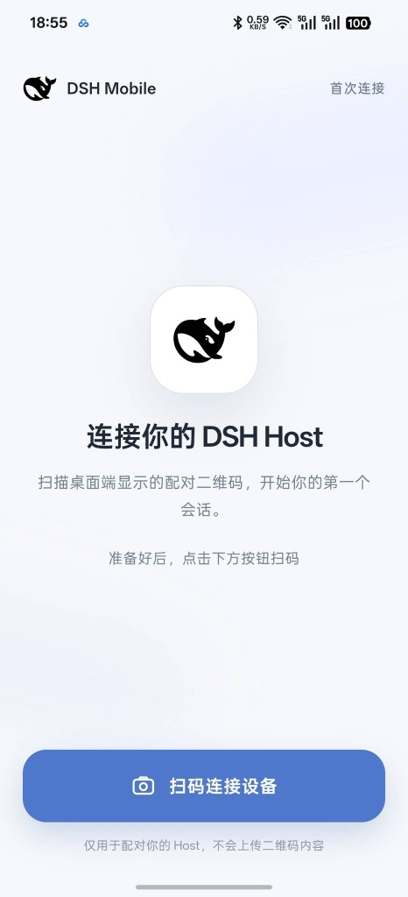

- **Scan to pair** — First launch is a camera screen. You can also open `dsh-mobile://pair#offer=…`. Scanning the same Host Identity updates that profile instead of duplicating it.
- **Encrypted tunnel first** — Automatic opens a sealed Tunnel immediately. Same-network WebRTC Direct may win only in a short race. Quick Tunnel and Relay see ciphertext frames; the Host Gateway never publishes the DSH web port.
- **Official features, phone composition** — Narrow width becomes a top bar, a single conversation column, a navigation drawer, and a details surface. Wide width keeps the official desktop layout.
- **Phone interaction layer** — An independent plugin maps Android Back, drawer swipes, long-press session menus, and hover-only controls back to official UI actions. Plain Enter inserts a newline; the Send button sends.
- **Cold start without a blank page** — Shell, fonts, and the mobile layout ship in the APK. Host plugin bundles cache by content hash. Reconnect stays inside the current document.
- **Several Hosts, revocable devices** — Switch Host Profiles in the app. Revoke a device from the Host; deleting a local profile is not revocation.
- **Background connection protection (experimental, off by default)** — Reduces WebView pauses in the background. It is not a guaranteed push channel.

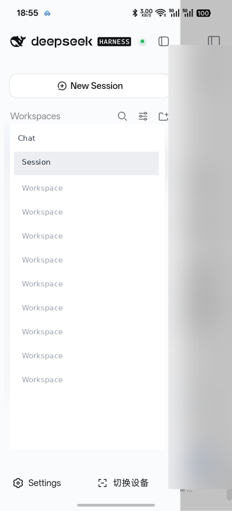

Narrow conversation chrome: session title, Chat / mode / log, composer, and compact stats. The composer opens the model list on the same screen.

| Conversation | Model picker |
| :---: | :---: |
| 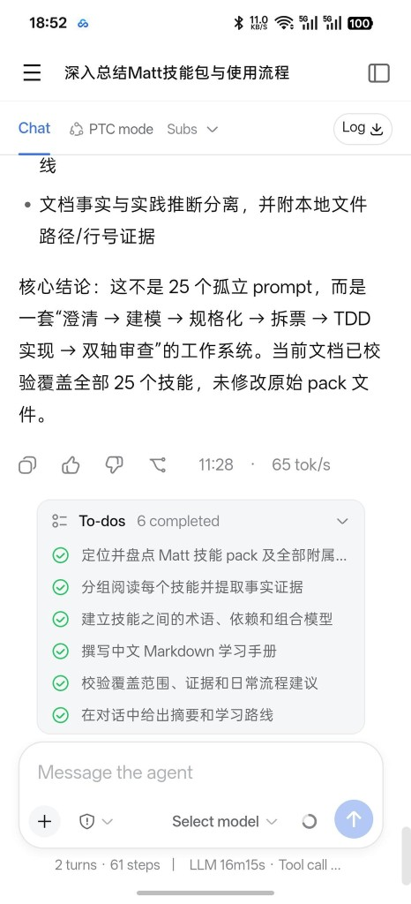 | 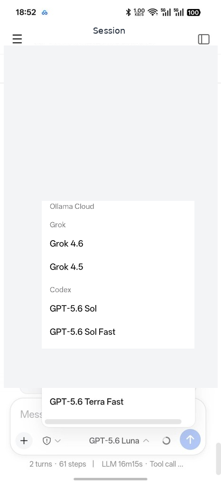 |

Settings use the same official sections, laid out for a hand. The official desktop settings sheet still squeezes on a phone-width browser.

| Phone settings | Official settings at phone width |
| :---: | :---: |
| 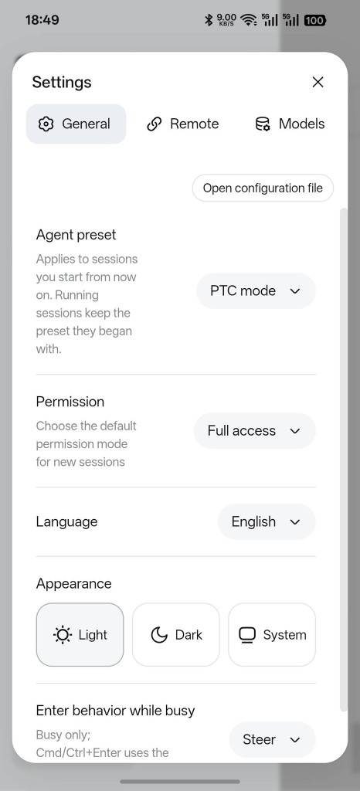 | 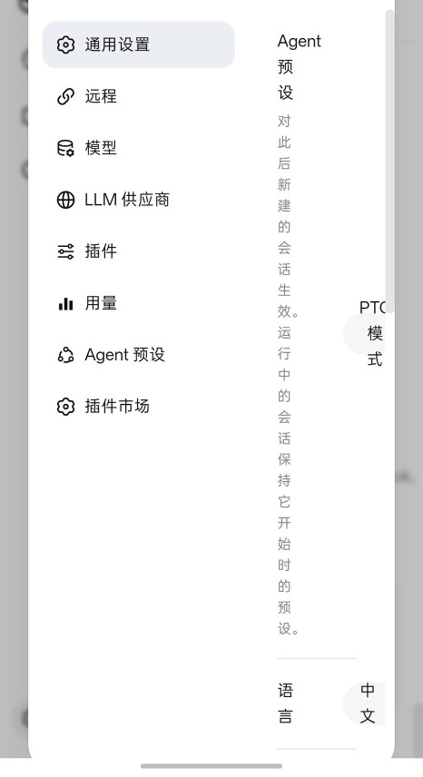 |

The composer plus button on a phone only offers **Command** and **Insert image**. Images still go through the Host's official draft-image path.

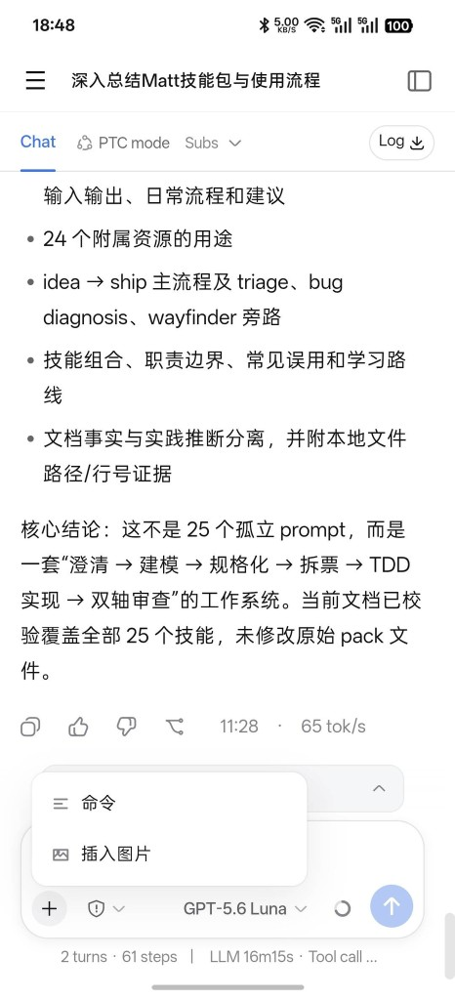

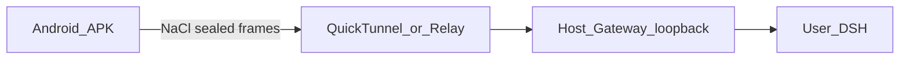

## Companion: Codex Sidebar

Install **[Codex Sidebar](https://github.com/NOirBRight/dsh-codex-sidebar)** on the same Host (command in [Install](#install)). On the desktop it occupies the official details column. On the phone that seat becomes a right-edge drawer: Files, Review, Browser, and Terminal are the same plugin, not a second mobile app.

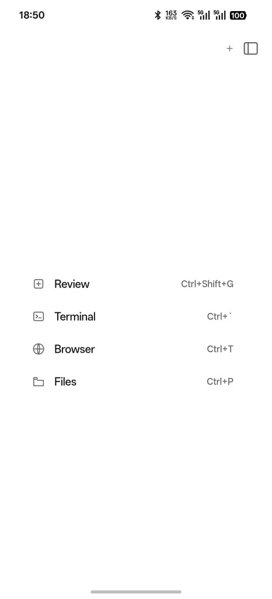

| Files | Terminal |
| :---: | :---: |
| 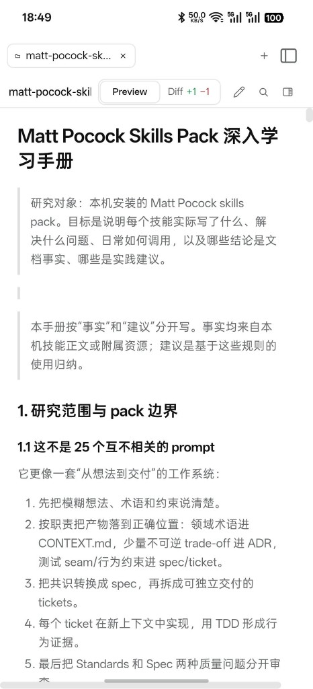 | 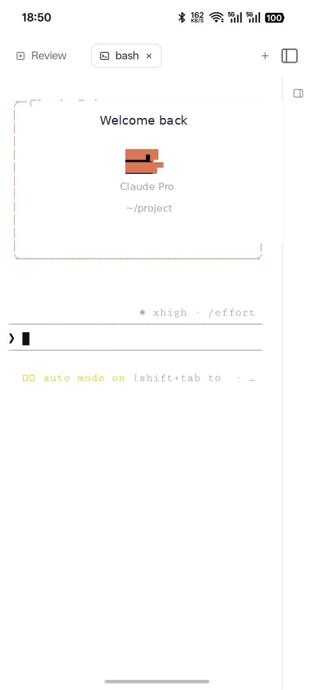 |

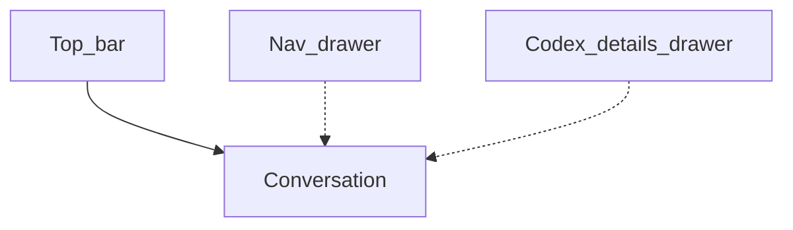

## Operator notes

- Every route still does a NaCl hello/ack anchored on the QR Host public key. Endpoint operators are untrusted pipes.
- Automatic is tunnel-first. Direct Only and Tunnel Only remain available. There is no TURN.
- Removing a profile in the app is local. Revoke the device on the Host to invalidate the token.
- Compatibility mode is the default: pairing, devices, Tunnel/Relay, and official UI keep working without patching Runtime. Boot always uses the official Runtime.

Build from source (Java 21 JDK and an Android SDK):

```sh
npm install
npm test
npm run build
npm run android:debug --workspace @dsh-mobile/mobile-web
```

Debug APK: `apps/mobile-web/android/app/build/outputs/apk/debug/app-debug.apk`. Signed release: `npm run android:release --workspace @dsh-mobile/mobile-web`.

Pairing configuration: the published [dsh-mobile-pairing](https://github.com/NOirBRight/dsh-mobile-pairing) repo (single source of truth; `dsh-mobile` consumes the tag/tarball without a local source mirror). Self-hosted Relay: [relay/deploy/README.md](relay/deploy/README.md). Layout contract: [docs/adr/0004-responsive-layout-and-design-ownership.md](docs/adr/0004-responsive-layout-and-design-ownership.md). Maintainer architecture: [docs/architecture.md](docs/architecture.md).

## License

[MIT](LICENSE)
