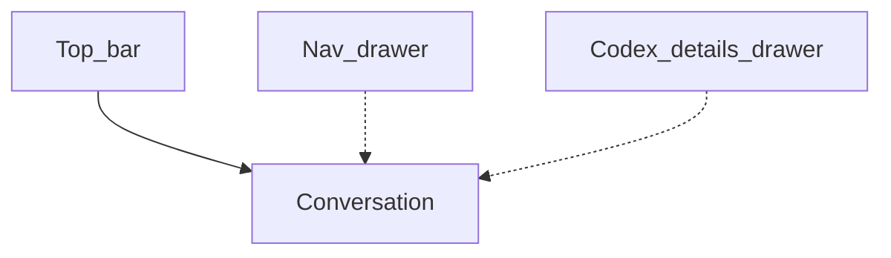

# dsh-mobile

中文 | [English](README.en.md)

把你自己的 [DeepSeek Harness](https://github.com/deepseek-ai/deepseek-harness) 装进口袋。扫码配对，端到端加密隧道，官方功能，手机布局。

这不是第二套 DSH，不是把 `:3080` 暴露到公网的浏览器壳，也不是架在别人域名上的托管产品。Host 仍是你已经在跑的那台机器。Android 应用只连接你当前选中的那一台 Active Host。

## 安装

需要本机已经在跑 [DeepSeek Harness](https://github.com/deepseek-ai/deepseek-harness) **0.1.0-rc.6** 或更高，手机要连的就是这台。

这是 **多份已发布的包**，不是 `npm i dsh-mobile`。Host 上先装 **远程**（配对插件），它会带上公开的隧道库。Codex Sidebar 可选，建议装。然后再装 APK。

```sh
dsh plugin --profile web add github:NOirBRight/dsh-mobile-pairing#v0.1.6
dsh plugin --profile web add github:NOirBRight/dsh-codex-sidebar#v0.3.8
dsh web
```

第二行是 Codex Sidebar（Files / Review / Browser / Terminal）。只要聊天可以不装。

配对插件 **v0.1.6** 依赖 [`@dsh-mobile/e2e-tunnel` v0.1.3](https://github.com/NOirBRight/dsh-e2e-tunnel/releases/tag/v0.1.3)。不要把隧道库再加进 DSH 插件列表。

然后在 Host 上打开 **设置 → 插件 → 插件配置 → DSH Mobile**（导航里叫 **远程**）。

1. **自动生成**（临时 Quick Tunnel）或 **填写地址**（你拿到的，或[自己部署](relay/deploy/README.md) 的 Relay）。
2. 刷新二维码。约 5 分钟有效，且一次性。

Android APK（已签名 **v1.1.0**）：

- 发布页：https://github.com/NOirBRight/dsh-mobile/releases/tag/v1.1.0
- APK：https://github.com/NOirBRight/dsh-mobile/releases/download/v1.1.0/dsh-mobile-1.1.0.apk

装上应用，打开后扫描 Host 二维码。

| 部件 | 当前版本 | 角色 |
|---|---|---|
| [dsh-mobile-pairing](https://github.com/NOirBRight/dsh-mobile-pairing)（`@dsh-mobile/pairing`） | [v0.1.6](https://github.com/NOirBRight/dsh-mobile-pairing/releases/tag/v0.1.6) | **必装。** Host 插件：二维码、设备、回环 Gateway、Tunnel / Direct。这就是 **远程**。 |
| [dsh-e2e-tunnel](https://github.com/NOirBRight/dsh-e2e-tunnel)（`@dsh-mobile/e2e-tunnel`） | [v0.1.3](https://github.com/NOirBRight/dsh-e2e-tunnel/releases/tag/v0.1.3) | 配套库。pairing 已经依赖它。 |
| [dsh-codex-sidebar](https://github.com/NOirBRight/dsh-codex-sidebar) | [v0.3.8](https://github.com/NOirBRight/dsh-codex-sidebar/releases/tag/v0.3.8) | **可选。** details 席位上的 Files / Review / Browser / Terminal。 |
| [dsh-mobile](https://github.com/NOirBRight/dsh-mobile) APK | [v1.1.0](https://github.com/NOirBRight/dsh-mobile/releases/tag/v1.1.0) | 手机应用。用上面的 APK 链接。 |
| Relay | [`relay/deploy`](relay/deploy/README.md) | 可选自托管密文转发。只用 Quick Tunnel 就跳过。 |

把隧道嵌进别的 Host 时才单独钉库（装手机不用跑）：

```sh
npm i github:NOirBRight/dsh-e2e-tunnel#v0.1.3
```

## 能做什么


- **扫码配对** — 首次启动只有相机页。也可以打开 `dsh-mobile://pair#offer=…`。同一 Host Identity 会更新已有档案，不会复制设备。
- **加密隧道优先** — Automatic 立刻走密封 Tunnel。同网 WebRTC Direct 只在短窗口里可以抢赢。Quick Tunnel 和 Relay 只看见密文帧；Host Gateway 不会公布 DSH 网页端口。
- **官方功能、手机构图** — 窄屏变成顶栏、会话单栏、导航抽屉和 details 面。宽屏仍用官方桌面布局。
- **手机操作层** — 独立插件把 Android 返回、抽屉滑动、长按会话菜单和 hover-only 操作转成官方界面动作；输入框普通回车换行，发送仍点发送按钮。
- **冷启动不白屏** — 壳、字体和窄屏布局打进 APK。Host 插件按内容哈希缓存。重连留在当前文档里，不整页刷新。
- **多 Host、可撤销** — 在应用里切换 Host Profile。在 Host 上撤销设备；本地删档案不等于吊销。
- **后台连接保护（实验，默认关）** — 减少 WebView 在后台被暂停。不是可靠的系统推送。


窄屏会话：顶栏标题、Chat / 模式 / 日志、composer、压缩统计行。模型列表从同一块 composer 打开。

| 会话 | 模型选择器 |
| :---: | :---: |
|  |  |

设置用官方分区，按手机构图。官方桌面设置页在手机宽度的浏览器里仍会被挤扁。

| 窄屏设置 | 官方设置在手机宽度下 |
| :---: | :---: |
|  |  |

手机上加号只提供 **命令** 和 **插入图片**。图片仍走 Host 官方的 draft-image 通道。


## 伴生：Codex Sidebar

请在同一台 Host 上安装 **[Codex Sidebar](https://github.com/NOirBRight/dsh-codex-sidebar)**（命令见[安装](#安装)）。桌面上它占用官方 details 列；手机上这个席位变成右侧抽屉。Files、Review、Browser、Terminal 仍是同一套插件，不是手机另做一版。


| Files | Terminal |
| :---: | :---: |
|  |  |



## 操作者细节

- 任何路径仍会做以 QR Host 公钥为锚的 NaCl hello/ack。端点运营方只是不可信管道。
- Automatic 隧道优先。Direct Only 与 Tunnel Only 仍可选。无 TURN。
- 应用里删除档案是本地操作。要作废凭证，请在 Host 上撤销设备。
- 默认兼容模式：配对、设备、Tunnel/Relay 和官方 UI 不修改 Runtime 也能工作。boot 永远走官方 Runtime。

从源码构建（Java 21 JDK 和 Android SDK）：

```sh
npm install
npm test
npm run build
npm run android:debug --workspace @dsh-mobile/mobile-web
```

调试 APK：`apps/mobile-web/android/app/build/outputs/apk/debug/app-debug.apk`。签名发布包：`npm run android:release --workspace @dsh-mobile/mobile-web`。

配对配置见 [plugins/pairing/README.md](plugins/pairing/README.md) 和已发布的 [dsh-mobile-pairing](https://github.com/NOirBRight/dsh-mobile-pairing)。自托管 Relay 见 [relay/deploy/README.md](relay/deploy/README.md)。布局契约见 [docs/adr/0004-responsive-layout-and-design-ownership.md](docs/adr/0004-responsive-layout-and-design-ownership.md)。维护者架构见 [docs/architecture.md](docs/architecture.md)。

## 许可证

[MIT](LICENSE)
